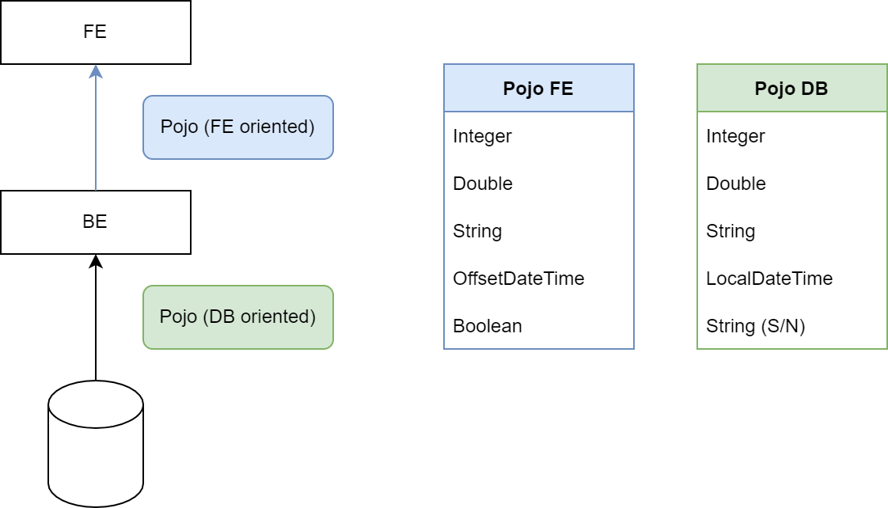

#  Convenzioni

## Pojo mapping

| Tipo     | Pojo Fe        | Pojo BE       |
| -------- | -------------- | ------------- |
| Intero   | Integer        | Integer       |
| Decimale | Double         | Double        |
| Valuta   | Double         | Double        |
| Test     | String         | String        |
| Data     | OffsetDateTime | LocalDateTime |
| Data/Ora | OffsetDateTime | LocalDateTime |
| Ora      | OffsetDateTime | LocalDateTime |
| Flag     | Boolean        | String (S/N)  |
| Boolean  | Boolean        | String (S/N)  |

